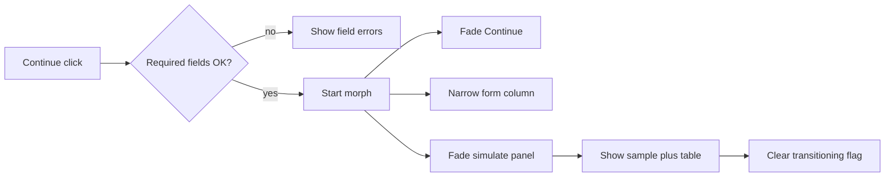

# WorkOS Layout B: map → validate morph transition

Date: 2026-08-27  
Status: Draft — awaiting user review before implementation plan  
Surface: Ted’s first choice only (`LayoutB` in `workos/`)

## Problem

Clicking Continue on the map phase hard-swaps two different React trees. The mapping form reappears on the validate phase, but the cut feels abrupt: the large simulate panel vanishes and the sample + table appear with no continuity.

## Goals

- **Continuity first:** the form stays mounted and narrows into the left rail.
- **Focus second:** attention lands on the validate column (sample dropzone + table) in the same right-hand slot the simulate panel occupied.
- **Reversible:** thin CSS + a short-lived transition flag; easy to delete and keep today’s hard swap if motion feels wrong.
- Respect `prefers-reduced-motion: reduce` with an instant cut.

## Non-goals

- Motion on Explore 2 / Explore 3 (`LayoutA` / `LayoutC`).
- Shared-element FLIP on individual inputs.
- Animation libraries (Framer Motion, etc.).
- Changing validation logic, required-field rules, or simulate-link behavior.

## Chosen approach: morph in place (Option A)

One stable Layout B shell:

| Region | Map phase | Validate phase |
|--------|-----------|----------------|
| Left | Mapping fields (wide) | Same fields (narrow ~22rem rail) |
| Right | Simulate empty-state panel | Upload sample dropzone + validation table |
| Below / with form | Continue button | Hidden |

The right slot keeps the same grid cell; content crossfades. The form column does not unmount across the phase change.

## Beat sheet

Timings are product-register (~150–250ms class). Slight overlap is intentional.

1. **Continue succeeds** (mappings + name valid as today).
2. **~100ms:** Continue fades out / is removed from tab order.
3. **~180ms continuity:** form column width eases wide → `minmax(0, 22rem)` rail; simulate panel fades out (`opacity`, optional slight scale).
4. **~220ms focus (starts ~120ms into step 3):** validate sample dropzone + table fade/slide in (`opacity` + `translateY(8px → 0)`).
5. **Settle:** clear transition flag; full interaction on validate UI.

**Reduced motion:** set `phase` to `validate` with no opacity/transform classes; end layout matches animated settle.

## Architecture

### Component shape

- Refactor `LayoutB` so map and validate are **one tree**, not two early returns.
- Left: always `MappingPanel` with `dropzonePlacement="none"` (simulate is not inside the panel during morph).
- Right slot:
  - Map: `SampleDropzone mode="simulate"`.
  - Validate: upload `SampleDropzone` + `ValidationTable`.
- Shell: CSS grid that changes column template via a phase/transition class on a wrapper (e.g. `layout-b layout-b--map` → `layout-b--validate`, with `layout-b--transitioning` during the beat).

### State

- Keep existing `phase: 'map' | 'validate'`.
- Add local `isTransitioning` (or derive from a short timeout) only while classes run.
- On Continue success: set transitioning, apply validate layout classes, then set `phase` to `validate` when the sequence ends (or set phase immediately and drive visuals from transitioning + phase). Prefer: set `phase` to `validate` at start of morph and use `isTransitioning` so content for validate can mount under opacity 0 without a second layout mode.

Exact flag wiring is an implementation detail as long as:

- Form fields do not remount (preserve input focus/values).
- Simulate unmounts only after its exit opacity finishes (or keep mounted at `opacity: 0` / `pointer-events: none` until done).
- Reduced motion skips delays.

### CSS

- Prefer `opacity`, `transform`, and grid template / `max-width` transitions; avoid animating large layout thrash where possible.
- No `!important`. Use existing NYSE tokens / Tailwind theme classes.
- Gate motion with `@media (prefers-reduced-motion: reduce)`.

### Files likely touched

- [`workos/src/App.tsx`](workos/src/App.tsx) — `LayoutB` shell + Continue handler timing
- [`workos/src/index.css`](workos/src/index.css) and/or co-located classes — transition keyframes/utilities
- Possibly [`workos/src/components/MappingPanel.tsx`](workos/src/components/MappingPanel.tsx) — map description / dropzone placement only if needed for the single-tree layout
- [`workos/src/components/SampleDropzone.tsx`](workos/src/components/SampleDropzone.tsx) — unchanged behavior; placement only

## Error handling / edge cases

- Invalid Continue: no morph; existing required-field errors only.
- Rapid double-click Continue: ignore while transitioning or after phase is validate.
- Reset / Version change: clear transitioning; jump to map with no exit animation required.
- Sample already attached on map: table still populates on validate as today once phase and files allow.

## Testing (manual)

1. Open `http://localhost:5173/workos/` (Vite HMR), Version = Ted’s first choice.
2. Fill Name + four fields (or Simulate valid input); Continue → form narrows, simulate fades, table column appears; no full-page flash.
3. Simulate incomplete → fix Price → Continue; morph still runs.
4. OS reduced-motion on → instant validate layout.
5. Reset prototype → back to map; morph does not stick.
6. Explore 2 / 3 → still hard swap (no morph).

## Revert path

Remove transitioning state and CSS classes; restore two early-return trees in `LayoutB` if desired. Product behavior (fields, simulate links, table dropzone) stays.

## Decision log

- Primary goal: continuity then focus (user choice C).
- Right panel: morph in place (Option A), with explicit option to abandon motion later.
- Scope: Layout B only.
